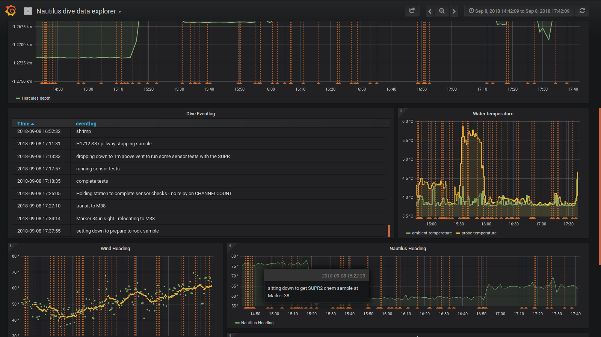

# NautilusLive dive data explorer

This repository contains a few work-in-progress projects exploring the dive data form [E/V Nautilus dives](http://nautiluslive.org)

The data presented on NautilusLive.org is not the
full/complete scientific record. Please go to http://www.oet.org for
information on accessing the archived dataset.

The most up-to-date version of the data explorer is based on Grafana and InfluxDB. The [full dashboard](dataexplorer.guttula.com:3000), may be online, but it is not always available. See this [snapshot of the dashboard](https://snapshot.raintank.io/dashboard/snapshot/9c2aKYuLh8wq4Y3nFI1Zj08gCgwiVMGs) if the live version in not abvailable.

