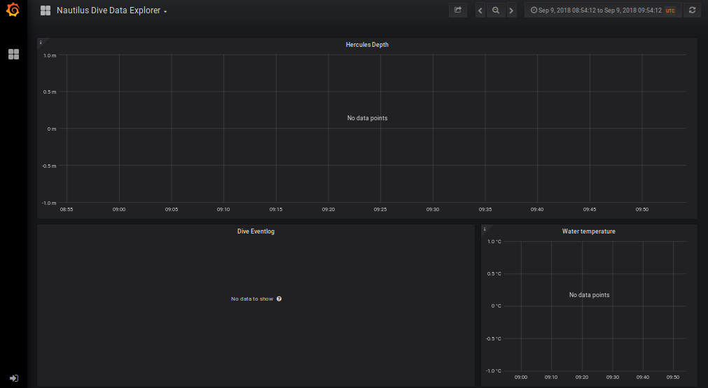

The Nautilus Dive Data Explorer is an online dashboard for viewing data form E/V Nautilus and the ROVs Hercules and argus. The software is open-source, and [hosted in a repository on GitHub](http://github.com/jarmokivekas/nautilus-dive-data-explorer).

[<button>Click here to go to the live dashboard</button>](http://dataexplorer.guttula.com:3000)

## Troubleshooting

### No data points

Sometimes the dashboard will say _No data points_ on all the panels.

The timespan is probably set to a range with not data, or it's a snapshot instead of the live application. Here are some options:

- If there is a dive going on right now, [click here to see current data updated in real time](http://dataexplorer.guttula.com:3000/d/H7uIBYhiz/nautilus-dive-data-explorer?orgId=1&from=now-3h&to=now).
- Use the menu on the top right to change the timespan.
- To find data from past dives, try using [the _Nautilus Dive Data Overview_ dashboard](http://dataexplorer.guttula.com:3000/d/VAU2Le2mz/nautilus-dive-data-overview?orgId=1).

