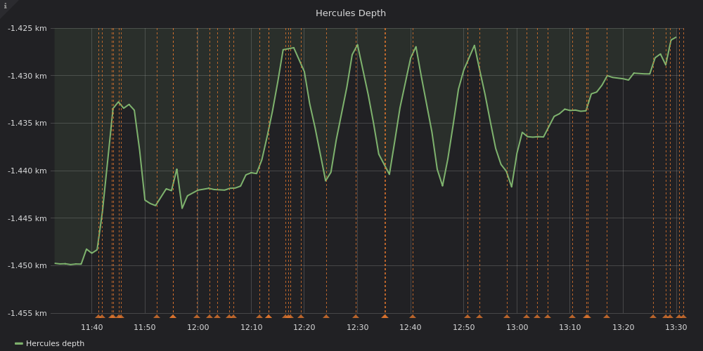
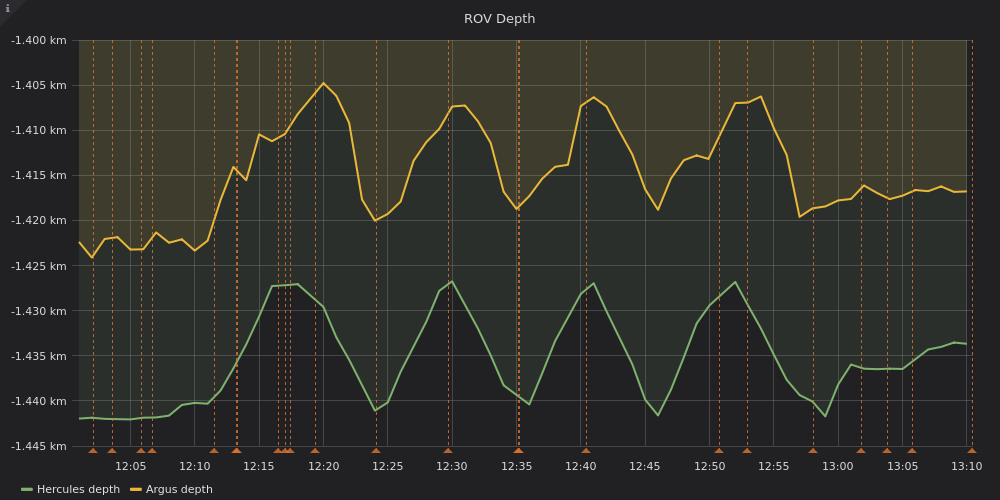

Hercules has laser-based sensors and high-resolution stereo cameras that can be used to get a better understanding of an area through mapping surveys. Surveys typically consist of transiting back and forth in a zig-zag pattern along evenly spaced parallel lines close to the seafloor.

Below is a plot of Hercules' depth data from a survey of some pillow lava near Lōʻihi Seamount on 09-09-2018. The x-axis is a timestamp in UTC.

Click the image to open an interactive view.

Hercules maps at a low altitude (distance from the sea floor), so the major shapes of the sea floor are visible in the ROVs depth data during a survey. Each peak and valley in the data corresponds to the end of a line.

With every peak in the data, Hercules is moving up the hill along one survey line, moving over to the next one, and then coming back down the hill along the other survey line. Repeat.

The annotations labeled EOL is short for End of Line. The annotation *EOL7*, the end of the seventh survey line should probably be at the valley at approximately `12:46`.  A member of the crew inputs the log entries manually, thus, the timestamps may be slightly early or slightly late, but the meaning still comes across, which is the crucial part.

A winch on the Nautilus continually adjusts  Argus' depth during a survey under the control of a crew member. A general target is to try to maintain Argus 20 to 25 meters above Hercules, but it also depends on the task at hand and the surrounding terrain.

To browse more data from this dive:

[<button>View the dive in the Dive Data Explorer</button>](http://dataexplorer.guttula.com:3000/d/H7uIBYhiz/nautilus-dive-data-explorer?orgId=1&from=1536491148736&to=1536511400181)
